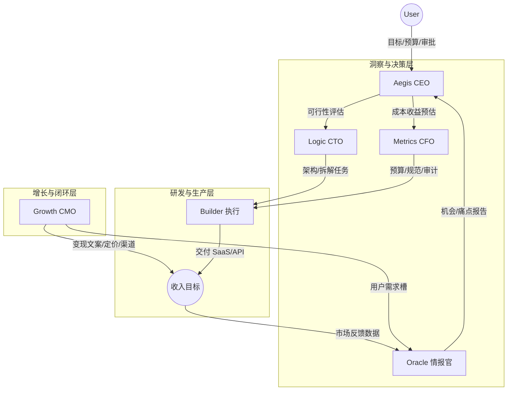

# 2026 OpenClaw 多 Agent 协作计划（SaaS 主线 / 激进探索版）

更新时间：2026-02-22

---

## 0. 北极星目标

- **目标**：2026 年通过 OpenClaw 驱动的产品化（SaaS/API 为主）实现累计 **100 万**收入。
- **主线**：SaaS / 可被 Agent 调用的 API 产品。
- **副产物**：知识影响力与基建经验沉淀（由 Growth 负责整理与变现素材化）。

> 战略取向：**激进探索**（快速试错），但必须配套“预算上限 + stop-loss + 状态机”，避免发散。

---

## 1. 盈利框架（三条相辅相成）

1) **知识影响力 / 经验结构化**
- 把个人经验 + OpenClaw/多 Agent 协作进化经验沉淀为对外内容（文章/视频/模板/课程）
- 目标：带来线索（lead）与信任，为 SaaS 提供分发与背书

2) **商业化产品（SaaS / Plan 升级 / API Token）— 主线**
- 选“足够痛”的问题，且必须能被 Agent 调用（API/脚本/明确接口）
- 收入：订阅、按量计费、增值功能（Pro/Team）、企业版

3) **基建/工作流/让 Agent 更聪明**
- 将更好的 agent workflow、提示词、技能组合方式对外分享/售卖
- 目标：形成方法论与资产库，为主线产品降低边际成本

---

## 2. 多 Agent 组织结构（常态 5 Agent + 按项目 Builder）

### 2.1 角色与职责

#### Aegis（总管家 / CEO / 调度者）
- **定位**：只看方向与结果；立项/否决/预算与里程碑；唯一调度者
- **审美准则**（不过线就 Pass）：极简 / 高可用 / 高溢价 / 可被 Agent 调用
- **关键权限**：
  - 唯一允许把任务从 `APPROVAL_NEEDED → BUILDING`
  - 关键文件（预算、发布配置）只允许 Aegis 修改（流程约束）

#### Oracle（首席情报官）
- **定位**：趋势/竞品/定价/渠道/套利空间；输出“机会报告”
- **手段**：网页搜索 +（可选）skills；无社媒 API 时先跑通流程

#### Logic（问题解决专家 / CTO）
- **定位**：技术最优路径；强制不造轮子；架构与拆解任务给 Builder
- **硬规则**：进入 BUILDING 前必须产出 `projects/<name>/SKILL_SEARCH.md`

#### Metrics（效能专家 / CFO）
- **定位**：预算/成本/token/ROI 口径；目录规范与熵增控制
- **关键权限**：唯一允许更新 `Budget.spent/remaining`

#### Growth（增长 / CMO）
- **定位**：渠道与转化、定价与文案钩子；沉淀副产物（内容/模板/经验）
- **周报结构**：渠道、曝光/点击/转化/CAC（无则代理指标）、用户原话 Top10、下一轮实验清单

#### Builder（项目专用执行，可多个）
- **定位**：只做落地（全栈实现）；极其听话、执行力爆表
- **强约束**：仅可在 `projects/<name>/` 内文件操作（系统提示词 + 审查校验）
- **生命周期**：由 Aegis 创建/冻结；**销毁必须由 User 授权**

---

## 3. 协作架构与信息流（上游触发下游）

### 3.1 总体原则
- 无缝协作、权责分明、经验共享
- 不重复造轮子（强制 SKILL_SEARCH）
- 经济化模型分配（该省省、该用强模型用强模型）
- 控制熵增（目录规范 + 任务状态机 + 可审计文件落盘）

### 3.2 架构图（Mermaid）



### 3.3 群聊协作机制（防刷屏）
- 类型1：主动指令 `@Agent名 [动作指令] --参数`
- 类型2：链式接力 `PASS_TO @Agent名 [上下文摘要]`
- 规则：**一个阶段只允许一个“主输出”**（建议对外由 Aegis 汇总），其他人只在被派单或被点名时输出。

---

## 4. 统一任务协议（TASK）与状态机

### 4.1 状态集合（有限集合）
- `DRAFT`
- `RESEARCHING`
- `APPROVAL_NEEDED`
- `BUILDING`
- `SHIPPING`
- `MEASURING`
- `ITERATING`
- `PAUSED`
- `CLOSED`

### 4.2 权限规则（软 RBAC）
- **只有 Aegis**：`APPROVAL_NEEDED → BUILDING`
- **只有 Metrics**：更新 `Budget.spent / Budget.remaining`
- **只有 User**：将任务 `CLOSED` 或允许销毁 Builder

### 4.3 强制消息模板（跨 Agent 交付）

```
TASK_ID:
Owner:
Input:
Output:
Deadline:
Budget:
Status:
NextAgent:
Blocking:
Links/Artifacts:
```

---

## 5. “不造轮子”强制产出：SKILL_SEARCH.md

进入 `BUILDING` 前必须在项目目录落盘：
- `projects/<name>/SKILL_SEARCH.md`

必须包含：
- 用 `find-skills` 搜索到的 skills（关键词 + 结果）
- GitHub 搜索关键词 + 参考仓库
- 为什么不用（缺功能/不维护/成本高/许可证/不稳定）
- 结论：自研哪些部分、复用哪些部分

---

## 6. 目录结构与最小项目文件集（强制）

### 6.1 强制目录
- `protocols/`：任务协议、状态机、审批规则、模型策略
- `tasks/`：任务台账 + 每个 TASK 文件
- `projects/<name>/`：项目实现区（Builder 唯一可写区）
- `reports/oracle/`、`reports/growth/`、`reports/metrics/`
- `assets/`：截图、导出材料
- `scripts/`：校验脚本

### 6.2 每个项目必须包含
- `README.md`：目标、ICP、定价、里程碑、指标
- `CHANGELOG.md`：对外发布节奏
- `METRICS.md`：指标定义、数据源、看板/日志位置
- `SKILL_SEARCH.md`：开工前检索记录

---

## 7. Builder 约束与审查门（无硬 RBAC 的补强）

### 7.1 Builder 系统提示词（摘要）
- 只能在 `projects/<name>/` 下读写
- 禁止修改 `protocols/`、`tasks/`、`reports/`、根目录关键文件
- 需要越界变更：先向 Aegis 申请，由 Aegis 亲自执行

完整版本见：`protocols/BUILDER_GUARDRAILS.md`

### 7.2 越界检测脚本（审查门）
- 脚本：`scripts/verify_scope.sh`
- 用法：
  - `scripts/verify_scope.sh projects/<name>/`
- 规则：审查 Builder 产出前必须通过；失败则回滚/重做。

---

## 8. 模型分配策略（经济化）

- Oracle / Growth：`openai-codex/gpt-5.2`
- Logic / Builder：`openai-codex/gpt-5.3-codex`
- Metrics：`openai-codex/gpt-5.3-codex`

原则：
- 进入 `BUILDING/SHIPPING` 才允许长上下文与高配推理密集工作
- Oracle/Growth 报告尽量“引用链接 + 提炼要点”，避免粘贴长文
- Metrics 输出尽量结构化（可计算口径）

---

## 9. OpenClaw 实际落地方式（多智能体路由）

### 9.1 Aegis 作为独立 Agent
- 已创建 agent：`aegis`
- Aegis 工作区：`~/.openclaw/workspace-aegis`
- Aegis agentDir：`~/.openclaw/agents/aegis/agent`

建议配置（已写入/同步）：
- Aegis 的 SOUL/IDENTITY/MEMORY（定义 CEO 调度风格与协议）
- mentionPatterns：`@Aegis` / `Aegis` / `🛡️`（用于群聊提及门控）
- Aegis 默认模型：`openai-codex/gpt-5.3-codex`

> 注意：不同渠道对“多 Agent 常态在线”的支持不同；当渠道不支持子会话 thread 绑定时，建议由 Aegis 单点对外输出，内部用文件落盘驱动协作。

---

## 10. 启动任务：机会池 → 选定首个 SaaS（已创建）

- 任务文件：`tasks/TASK-20260222-001.md`
- 当前状态：`RESEARCHING`
- 目标：产出 3 个 14 天可卖 MVP 的 SaaS 备选，选 1 个进入 `BUILDING`

派单清单（按任务文件执行）：
- Oracle：5 个机会（痛点一句话、ICP、竞品/定价、渠道、为何现在）
- Growth：每个机会给最可能的增长路径 + 最小文案钩子
- Logic：TOP3 技术可行性与最短交付路径（含 skills 复用可能）
- Metrics：每个机会的验证成本上限 + stop-loss 建议

---

## 11. 运行纪律（建议写在 Aegis 的日常节奏里）

- **每日**：Aegis 汇总“在研任务状态 + 下一步”
- **每周**：Growth 周报（渠道/转化/用户原话/实验） + Metrics 成本报表
- **每个项目里程碑**：必须有 `CHANGELOG` 记录与可复现的 demo/部署方式

---

## 12. 相关仓库文件索引（你的操作入口）

- 协议与规范：`CONVENTION.md`、`protocols/*`
- 任务台账：`tasks/TASKS.md` + `tasks/TASK-*.md`
- 项目模板：`projects/_template/*`
- 报告目录：`reports/oracle/` `reports/growth/` `reports/metrics/`
- 越界检测：`scripts/verify_scope.sh`
